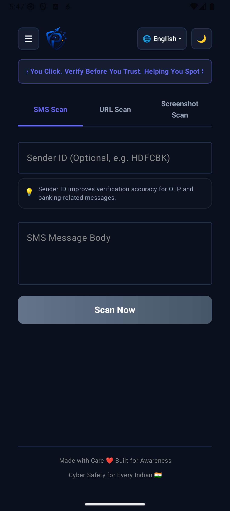

# 🛡️ PhishGuard India — Android APK Testing Guide

Welcome to the **PhishGuard India** testing repository! This public repository is set up for testers and friends to easily download, install, and test the PhishGuard India Android application.

PhishGuard India is a specialized threat scanner designed to protect Indian mobile users from SMS spoofing, UPI billing fraud, typosquatted banking domains, and screenshot brand impersonation.

---

## 📱 Application Interface

Here is a preview of the PhishGuard India application interface running on the Android Emulator during a statement scan verification:



---

## 📥 1. Download the App

Download either of the compiled Android package binaries below directly to your Android device:

*   **[phishguard-debug.apk](./phishguard-debug.apk) (Recommended)**: Best for testing. Built with debug logs enabled and accepts any local or cloud endpoints.

---

## ⚙️ 2. How to Install (Sideloading)

1.  Open this page on your Android mobile browser and download the `.apk` file.
2.  Open your file manager or browser downloads and tap the downloaded APK.
3.  If prompted, enable **"Allow installation from unknown sources"** in your browser/file manager settings.
4.  Tap **Install** and launch **PhishGuard India** from your app drawer.

---

## 🔌 3. Connect to the API Backend Server

PhishGuard requires a backend server to query live APIs (like Google Safe Browsing, Gemini AI, and VirusTotal). By default, the app points to `http://10.0.2.2:8000` (the Android emulator local bridge).

To configure the server for your device:
1.  Tap the **Settings (gear icon)** in the top-right corner of the PhishGuard App header.
2.  Enter the URL of your active API backend:
    *   **Live Cloud Service (Render)**: Set the server URL to your deployed Render service endpoint:
        ```
        https://phishguard-backend-drrz.onrender.com
        ```
3.  Tap **Save API Configuration**. You are now ready to scan!

---

## 🧪 4. Testing Scenarios (Try These Out!)

You can copy and paste the following test cases in the app's scanner tabs to check different verification verdicts and DLT mapping decoders.

### Test Case A: Safe Credit Card Statement (Legitimate Override)
*   **Tab**: `SMS Scan`
*   **Sender ID**: `VM-HDFCBK-S`
*   **Message Body**:
    ```text
    HDFC Bank Credit Card XX6449 Statement:
    Total due: Rs.-1,207.00
    Min.due: Rs.0.00
    Pay by Nil
    View: https://1.hdfc.bank.in/HDFCBK/v/EQOBHO
    ```
*   **Expected Result**: **🟢 LOW — Appears Legitimate** (Risk: 10/100).
    *   *Why*: The scanner detects a legitimate registered DLT header (`HDFCBK` for HDFC) and matches it to a secure, official HDFC `.bank.in` subdomain.
    *   *AI Verification Details*:
        *   `SMS Origin: Sent via Vodafone Idea (Vi) in the Mumbai circle.`
        *   `SMS Type: Classified as Service messages, such as general customer engagement based on DLT suffix (-S).`

### Test Case B: Personal Callback Scam (Critical Threat)
*   **Tab**: `SMS Scan`
*   **Sender ID**: `9812345678` (or leave empty)
*   **Message Body**:
    ```text
    Dear Customer, your electricity connection will be disconnected tonight at 9:30 PM due to non-payment of last month's bill. Please call the office manager immediately at 9876543210.
    ```
*   **Expected Result**: **🔴 CRITICAL — Very Likely Phishing** (Risk: 85/100+).
    *   *Why*: Flags a personal 10-digit mobile sender claiming to be a utility company combined with a suspicious personal callback number and urgent disconnection keywords.

### Test Case C: Typosquatting KYC Attack (Critical Threat)
*   **Tab**: `SMS Scan`
*   **Sender ID**: `9812345678`
*   **Message Body**:
    ```text
    Dear SBI customer, your NetBanking account has been blocked due to missing PAN card details. Please update immediately to avoid card suspension: http://onlinesb1.xyz/kyc. Never share your OTP.
    ```
*   **Expected Result**: **🔴 CRITICAL — Very Likely Phishing** (Risk: 100/100).
    *   *Why*: Bypasses Gemini entirely via local early-exit heuristics. Flags typosquatted domain `onlinesb1.xyz` pretending to be `onlinesbi.sbi`, combined with an OTP request and insecure URL in the same SMS.

### Test Case D: Offline Typosquatting Checker (URL Scan)
*   **Tab**: `URL Scan`
*   **URL**: `hdfcbank-netbanking.bank.in`
*   **Expected Result**: **🟠 HIGH — Likely Suspicious** (Risk: 65/100).
    *   *Why*: The app's embedded SQLite database offline typosquatting engine immediately intercepts the domain for containing the brand signature `hdfcbank` without being the official domain, warning you without sending any external network request!

---

## 🇮🇳 Features Included
*   **TRAI DLT Decoder**: Automatically parses SMS prefixes to detail the carrier and circle region, and suffixes to identify message classification (Transactional, Service, Promotional, Government).
*   **Offline Lookalike Guard**: Instant offline typosquatting checks against the official *India Financial Websites Reference List (2026)*.
*   **Local Heuristics Early-Exit**: Bypasses AI requests for obvious scams to safeguard LLM resource quotas.
*   **Language Localization**: Instantly translate threat alerts into English, Hindi (हिंदी), and Gujarati (ગુજરાતી).
