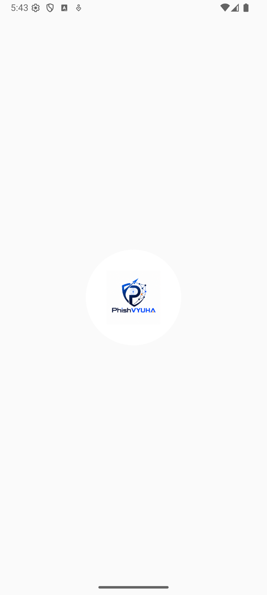

# 🛡️ PhishVYUHA — AI-Powered Phishing & Scam Defense

**PhishVYUHA** is an advanced phishing and scam detection application built specifically to secure users against the evolving threat landscape in India. By leveraging crowdsourced threat intelligence databases and modern Artificial Intelligence (AI) models, PhishVYUHA evaluates suspicious SMS messages, lookalike URLs, and screenshot visual mimicry in real time.

> [!IMPORTANT]
> **Technical Note**: This application is designed using crowdsourced databases and AI tools to identify, validate, and verify threat signals dynamically.

---

## 📸 Application Screenshots

### Fresh Application Launch & Main Screen
The premium landing page showing the security suite ready to scan.

### 1. English UI & SMS Testing
* **Main Screen Launch**:
  
  *One-liner: The premium landing page in English showing the updated security suite ready to scan.*
* **SMS Verification Input**:
  
  *One-liner: Input interface for checking a legitimate DLT transactional banking SMS.*
* **Safe SMS Scan Result**:
  
  *One-liner: Verification result flagging the DLT-compliant bank transaction as low risk.*
* **SMS Scam Input**:
  
  *One-liner: Input interface for checking an electricity disconnection SMS scam.*
* **Scam SMS Critical Alert**:
  
  *One-liner: Critical risk alert flagging high-urgency keywords and personal number bank impersonation.*

### 2. Multi-lingual Support (Hindi & Gujarati)
* **Gujarati UI Layout**:
  
  *One-liner: The main application interface fully localized in Gujarati.*
* **Gujarati SMS Verification Input**:
  
  *One-liner: Scanning a Gujarati language transactional bank phishing SMS.*
* **Gujarati Phishing Result**:
  
  *One-liner: Risk assessment report detailing lookalike SBI links in Gujarati.*
* **Hindi UI Layout**:
  
  *One-liner: The main application interface fully localized in Hindi.*
* **Hindi URL Scan Input**:
  
  *One-liner: Input interface for scanning a lookalike bank URL with Hindi localized context.*
* **Hindi Phishing Warning Result**:
  
  *One-liner: Phishing alert screen explaining the brand impersonation details in Hindi.*

### 3. URL Scanning Tests
* **Safe Bank Domain Verification**:
  
  *One-liner: Verification of an official, registered HDFC banking domain.*
* **Spoofed Bank Domain Verification**:
  
  *One-liner: Critical risk warning for a typo-squatted lookalike bank domain (`hdfcbank.icu`).*

### 4. Multimodal Screenshot Scanning (Gemini Vision)
* **Screenshot Upload Select**:
  
  *One-liner: Panel configuration for selecting and uploading an image for OCR and layout analysis.*
* **Suspicious SMS Screenshot Upload**:
  
  *One-liner: Uploading a screenshot of a suspicious message for backend Gemini OCR extraction.*
* **SMS Screenshot Extraction Result**:
  
  *One-liner: Gemini-powered analysis verifying content and extracting lookalike URLs from the uploaded screenshot.*
* **Login Portal Impersonation Upload**:
  
  *One-liner: Uploading a screenshot of a suspicious login form to check visual design alignment.*
* **Visual Mimicry Critical Warning**:
  
  *One-liner: Critical warning highlighting visual impersonation indicators from the login page screenshot.*

---

## 🚀 Key Features

* **TRAI DLT SMS Header Validator**: Instantly flags fake banks, bad suffixes, or spoofed alphanumeric headers by parsing sender IDs against standard TRAI DLT formats.
* **Crowdsourced Threat Feeds**: Integrated with open threat intelligence resources (including PhishTank, AbuseIPDB, and urlscan.io) to match domains against real-time blacklists.
* **Lookalike & Typosquatting Resolver**: Evaluates link structures (using algorithms like Levenshtein distance) to detect brand impersonation (e.g. typosquatting bank portals or e-commerce names).
* **Gemini Vision OCR Analyzer**: Uses multimodal AI to scan screenshot attachments (such as banking portals, WhatsApp chats, or payment receipts) and verify their layout consistency against known brand designs.
* **Multi-lingual Support**: All UI layouts, threat alerts, and AI explanations translate instantly into **English**, **Hindi (हिन्दी)**, and **Gujarati (ગુજરાતી)**.
* **Offline-First Resilience**: Local SQLite database tables seed trusted Indian domains, known DLT headers, and matching threat keywords on launch, ensuring users remain protected even without internet access.

---

## 📦 Installation Guide

1. **Download the APK**:
   * **Production Version (Obfuscated & Optimized)**: [phishvyuha-release.apk](phishvyuha-release.apk) (Only ~6.85 MB!)
   * **Developer Version**: [phishvyuha-debug.apk](phishvyuha-debug.apk)
2. **Enable Unknown Sources**:
   * Go to **Settings > Apps > Special app access > Install unknown apps** on your Android device, and toggle it on for your browser or file manager.
3. **Install the App**:
   * Open the downloaded `.apk` file and tap **Install**.
4. **Permissions**:
   * PhishVYUHA operates on a privacy-first model and **requires zero system permissions** (no background SMS readers, no contact lists, no location trackers).

---

## 🧪 Testing Scenarios

You can verify the app's rules using the following test cases in the app's **SMS** or **URL** scan inputs:

### Scenario 1: Legitimate Bank Transaction (SMS Scan)
* **Sender ID**: `HDFCBK` (or `SBIINB`)
* **Message Body**: `Your a/c no. XXX1234 has been credited with Rs 5,000.00 on 2026-06-21. Info: UPI-Transfer.`
* **Expected Result**: `🟢 LOW — Appears Legitimate` verdict (safely bypassed via DLT verified sender rules).

### Scenario 2: Electricity Disconnection Scam (SMS Scan)
* **Sender ID**: Keep blank or input a 10-digit number.
* **Message Body**: `Dear customer your electricity power connection will be disconnected tonight at 9:30 PM from power office because your previous month bill was not updated. Please contact immediately at 9876543211.`
* **Expected Result**: `🔴 CRITICAL — Very Likely Phishing` (triggered by high-urgency keywords and P2P mobile phone callback requests).

### Scenario 3: Legitimate Brand Portal (URL Scan)
* **URL Input**: `https://www.hdfcbank.com/personal`
* **Expected Result**: `🟢 LOW — Appears Legitimate` (recognized safe domain).

### Scenario 4: Typosquatted Banking Phishing (URL Scan)
* **URL Input**: `http://secure-update-hdfcbank.icu`
* **Expected Result**: `🔴 CRITICAL` (flagged for brand impersonation warning, insecure HTTP scheme, and suspicious `.icu` TLD).

---

## ⚖️ AI Disclaimer

> [!WARNING]
> AI may make mistakes, so always remain vigilant and verify information independently before taking responsive actions.
